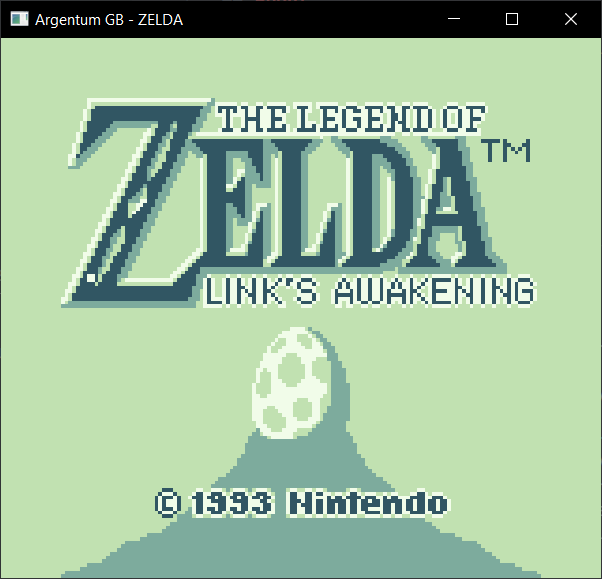
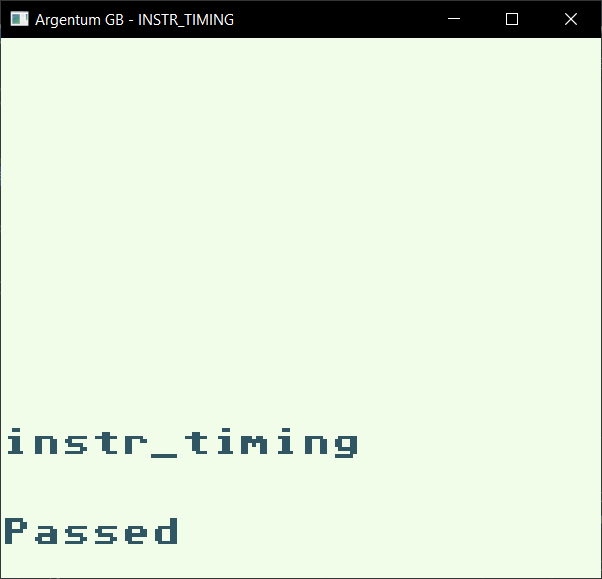

# Argentum GB

A simple Game Boy (DMG) emulator written in Rust.

## About

This is a toy emulator. I wrote this emulator to learn more about emulation.
This emulator is not bug-free, nor it should be taken as a reference.

Some features missing from this emulator are,

1. APU (Audio Processing Unit)
2. MBC2, MBC5, and some other mappers.
3. CGB support.

## Building

You can build the project using `cargo`.

```bash
cargo build --release
```

and to execute a ROM,

```bash
./argentum-gb <ROM FILE>
```

## Screenshots

### Games

 &nbsp;
 &nbsp;
 &nbsp;

### Test ROM(s)

 &nbsp;
 &nbsp;
 &nbsp;

## Acknowledgements

The emulator would not be possible without the following resources,

### Documentation and References

1. [Pandocs](https://gbdev.io/pandocs/)
2. [Izik's Opcode Map](https://izik1.github.io/gbops/index.html)
3. [RGBDS](https://rgbds.gbdev.io/docs/v0.4.1/gbz80.7)
4. [Optix's GBEDG](https://hacktix.github.io/GBEDG/)
5. [Game Boy - Complete Technical Reference](https://gekkio.fi/files/gb-docs/gbctr.pdf)
6. [wheremyfoodat's SM83 Instruction Decoding Guide](https://cdn.discordapp.com/attachments/465586075830845475/742438340078469150/SM83_decoding.pdf)

### Other Emulators

1. [BGB](http://bgb.bircd.org/)
2. [Mooneye GB - Gekkio](https://github.com/Gekkio/mooneye-gb)
3. [Purple Boy - Kappamalone](https://github.com/Kappamalone/PurpleBoy)
4. [Beeg-Boy - wheremyfoodat](https://github.com/wheremyfoodat/Beeg-Boy)
5. [CryBoy - Matthew Berry](https://github.com/mattrberry/CryBoy)

### Blogs and Talks

1. [[emudev]](http://emudev.de/gameboy-emulator/overview/)
2. [Ultimate Game Boy Talk - Michael Steil](https://www.youtube.com/watch?v=HyzD8pNlpwI)

## License

This project is licensed under the terms of the Apache-2.0 license.
