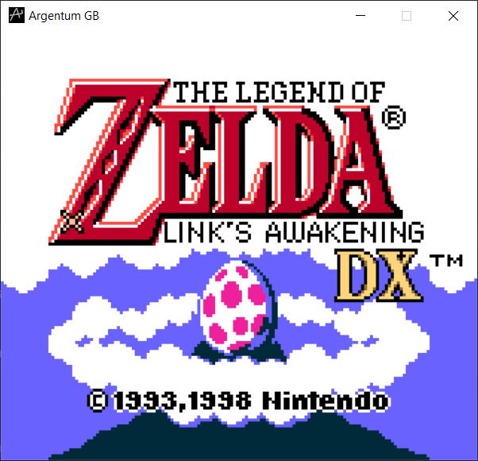

# Argentum

Argentum is a Game Boy Color emulator written in Rust.

 &nbsp;
 &nbsp;
 &nbsp;
 &nbsp;

## Installation

Argentum uses SDL2. You don't need to install SDL2 as it is bundled with
the emulator dependencies.

The only requirements are that you have the _latest_ stable Rust compiler, CMake and
a working C compiler.

After ensuring the above, clone the repository and run `cargo build --release`. The binary will be created
in the directory `./target/release`. You can then copy the binary to any location of your choosing.

**Note: There are prebuilt binaries available for Windows and Linux platforms in the
releases section.**

## Usage

You can check the CLI's help section for usage details.

```ascii
./argentum-native --help
```

## Features

Argentum is certainly not perfect, but it supports the following features.

- Passing blargg's CPU tests, instruction timing tests and memory timing tests.
- Passing all of mooneye-gb timer (not timing!) tests.
- PPU (scanline-based) which passes the dmg-acid2 and cgb-acid2 PPU tests.
- Great CGB Support.
- MBC1 (no multicarts), MBC3 (no RTC) and MBC5 (no rumble) cartridges are supported.
- Support for sound with all sound channels working as intended.
- Boot ROM support (right now only SameBoot is supported).
- Battery Saves support (extremely experimental, should not be relied upon!)

## Resources

The emulator would not be possible without the following resources,

### Documentation and References

1. [Pan Docs](https://gbdev.io/pandocs/)
2. [izik's opcode table](https://izik1.github.io/gbops/index.html)
3. [GBEDG](https://hacktix.github.io/GBEDG/)
4. [Game Boy - Complete Technical Reference](https://gekkio.fi/files/gb-docs/gbctr.pdf)
5. [SM83 Instruction Decoding Guide](https://cdn.discordapp.com/attachments/465586075830845475/742438340078469150/SM83_decoding.pdf)

### Other Emulators

1. [BGB](http://bgb.bircd.org/)
2. [Mooneye GB - Gekkio](https://github.com/Gekkio/mooneye-gb)
3. [CryBoy - Matthew Berry](https://github.com/mattrberry/CryBoy)

### Blogs and Talks

1. [[emudev]](http://emudev.de/gameboy-emulator/overview/)
2. [Ultimate Game Boy Talk - Michael Steil](https://www.youtube.com/watch?v=HyzD8pNlpwI)

## License

Argentum is licensed under the terms of the Apache 2.0 license.
